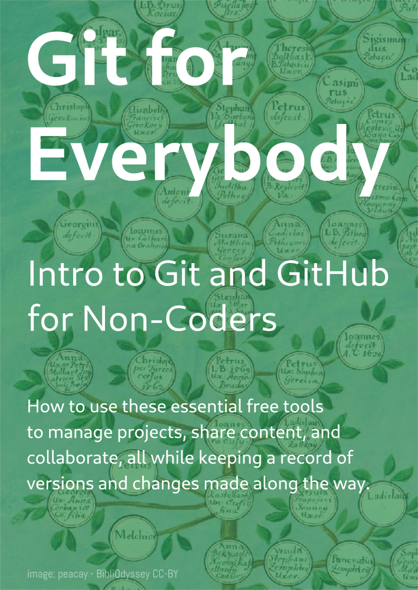

# Git for Everybody
**Intro to Git and GitHub for Non-Coders**

Git is a free and open-source version control tool widely used in coding and an essential tool for open-source collaboration. But it can also be used for more than just coding, empowering artistic and cultural projects by enabling greater exchange, broader publication, more flexible development and more!

Although built for programmers, Git is an amazing tool that anybody can use to manage almost any kind of content! Be it text, images, publications or 3D models, you can put pretty much anything you want into a Git repository.

Git allows you to easily manage versions of files, share them, collaborate with friends and colleagues, create backups, and more. Through an online Git platform like GitHub, you can publish documentation, create an open data repository, and even host a website for free!

Whilst simple to use, Git can be challenging for new users, especially for those who are not necessarily interested in using it for software development. This 3-hour workshop will explain and demonstrate the many functionalities and ways of using Git and teach you how to use Markdown (a simple formatting syntax).

This workshop provides a hands-on activity suitable for complete beginners.

## Requirements

- Create a free account on GitHub prior to your attendance. You can follow the instructions here.
- Bring a short recipe with you to add to the Food to Fork repository ([github.com/tiago-rorke/food-to-fork](https://github.com/tiago-rorke/food-to-fork)), and as part of the workshop exercise.

No prior experience with Git, Github, Markdown or coding is necessary. This is a workshop suitable for beginners.

---

## Outline

[Slides PDF](slides.pdf)  
[Slides Notes](slides.md)  

## Glossary

- `repo`
- `add`
- `stage`
- `commit`
- `checkout`
- `push`
- `pull`
- `fetch`
- `branch`
- `merge`
- `diff`
- `fork`
- `clone`
- `revert`
- `rebase`
- `stash`
- `tag`
- `origin`
- `main`
- `remote`
- `version control`
- `source control`
- `distributed version control`

---

## Links

- [Installing Git without GitHub Desktop](https://github.com/git-guides/install-git)
- [Dan Shiffman the Coding Train - Git and GitHub for Poets](https://www.youtube.com/playlist?list=PLRqwX-V7Uu6ZF9C0YMKuns9sLDzK6zoiV)
- [Jeff Palmer Git: An Interactive Development History](https://jpalmer.dev/2021/05/interactive-git-history/)
- [Manuscript-CSS](https://github.com/taw00/manuscript-css) Write in a Text Editor. Export to Manuscript Format. For Creative Writers
- [diff3d](https://github.com/bdlucas1/diff3d) - Visually diff 3D models
- [Aaron Swartz Documentary - The Internet's Own Boy](https://en.wikipedia.org/wiki/The_Internet%27s_Own_Boy)
https://drjekyllthemes.github.io/all  
https://quartz.jzhao.xyz/  

### Other Repository Services

- [GitLab](https://gitlab.com/)
- [Bitbucket](https://bitbucket.org/)
- [Sourceforge](https://sourceforge.net/)
- [Forgejo](https://forgejo.org/)
- [Gitea](https://about.gitea.com/)
- [Radicle](https://radicle.xyz/)

https://en.wikipedia.org/wiki/Comparison_of_source-code-hosting_facilities

### Interesting uses of Git

https://github.com/solarpunklab/solarpunk-lab
https://gitlocalize.com/

https://github.com/hansgaensbauer/Well-Monitor

---

The background image used in the slides and poster is a family tree from a Croatian genealogical book from 1740 - [BibliOdyssey CC-BY-SA-2.5](https://bibliodyssey.blogspot.com/2007/07/croatia-patachich-estates.html)